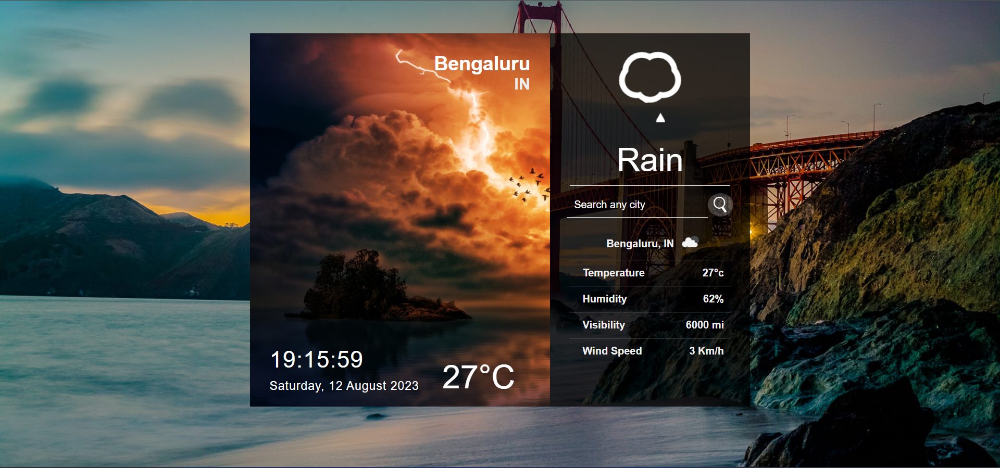

Prerequiste:
1. Download the latest version of Python
    This project was built on Python version 3.11.4
2. Download the latest Node js from the server 
   https://nodejs.org/dist/v20.5.1/node-v20.5.1-x64.msi

In order to setup the project
1. Clone the repository from GitHub to the local machine.
2. Open your terminal
3. Run the command 
    pip install requrirement.txt 
4. Change the directory to the frontend
    cd frontend
5. Run the command to install all the required dependencies
    npm install
6. Build the project using 
    npm build
7. To run the python server, go to home directory
    python manage.py runserver

The initial screen which access the user location

The screen which will accept input from user
